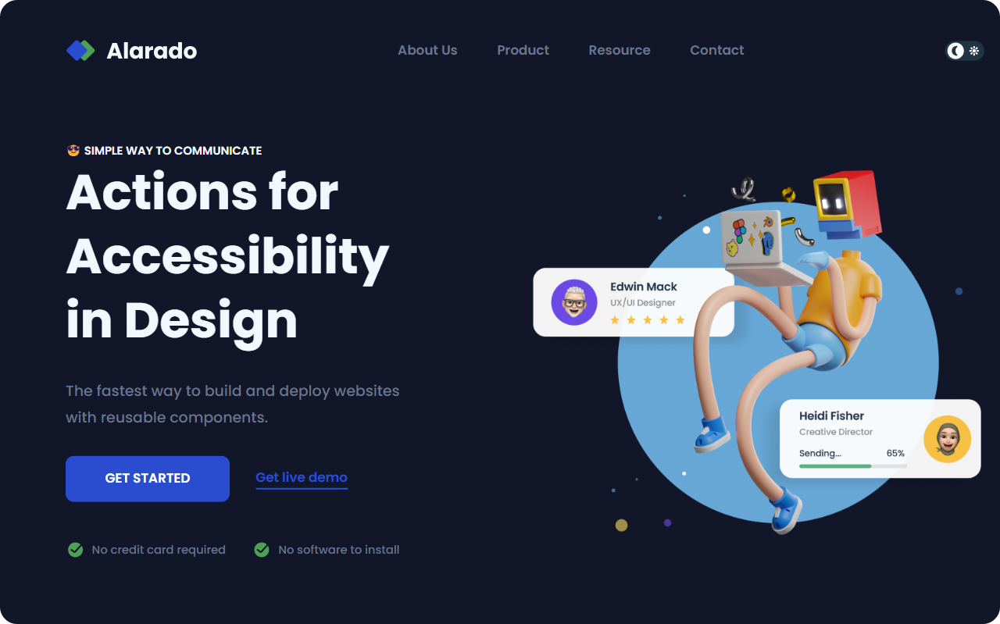

# Simple Homepage

This simple homepage features a navigation menu, logo, and content sections, along with the ability to toggle between light and dark themes.

[Live Demo](https://arman-anm.github.io/Simple-Homepage)

### Screenshot

Large Screen - Dark theme:

### Key Features

- **Responsive Design**: Adapts to mobile and desktop views.
- **Theme Toggle**: Switch between light and dark themes seamlessly.
- **Mobile Navigation**: Hamburger menu for mobile devices.

### Built With

- **HTML5**: Structured content
- **CSS3**: Styling with Flexbox
- **JavaScript**: Handling theme toggling and menu interactions
 
## Shoutout
This project is based on the [Simple Homepage Challenge](https://devchallenges.io/challenge/simple-hompage-alarado) by [DevChallenges](https://devchallenges.io/)  `:)`